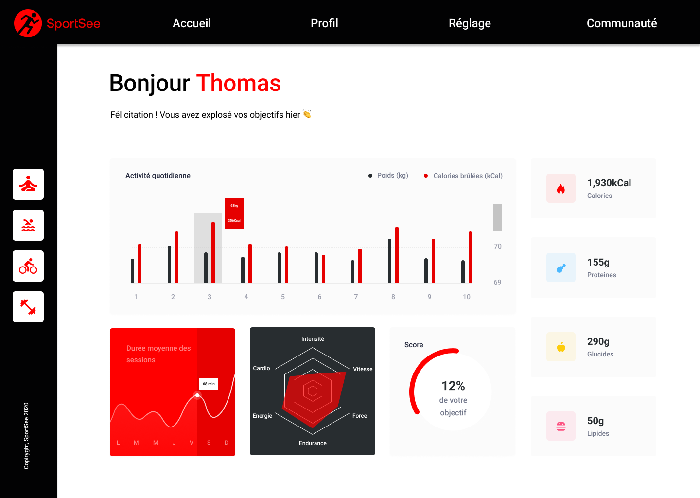

# SportSee: user page

## 1: Prerequisites

- NodeJS [(version 12.18 or newer)](https://nodejs.org/en/)

## 2: Download the repository

Download the zip or clone the repository.

## 3: Launching the backend

Follow the instruction [here](https://github.com/OpenClassrooms-Student-Center/P9-front-end-dashboard)

## 4: Launching the frontend

Inside the client directory:

- The `npm install` command will allow you to install the dependencies.
- The `npm start` command will allow you to run the frontend.

## Preview user's page

There is 2 demo users.

You can access there page at the following url

localhost:3000/user/12
localhost:3000/user/18

The port will change if another service run on this one.
Check the console for the right port.
